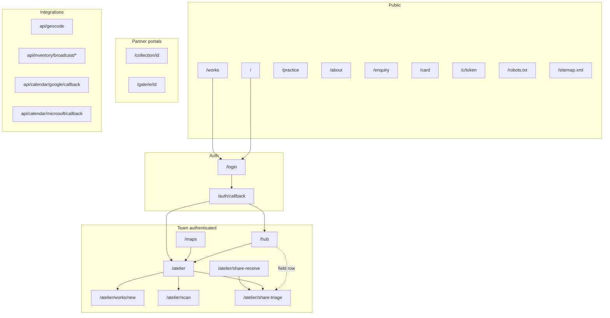
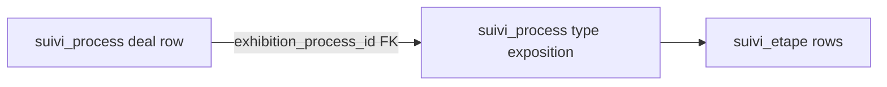

# PEM Hub — site map (authoritative routes & surfaces)

**Audience:** engineers and studio operators. **Companion:** QA checklist PDF (Atelier → System → download). **Diagrams:** Mermaid blocks below render on GitHub and most Markdown previews.

**Stack:** Next.js 15 App Router, Supabase auth, R2 (EU endpoint). **i18n:** user-facing UI is FR/EN via `lib/i18n/dictionary.ts` (modular [`lib/i18n/dictionary/`](../lib/i18n/dictionary/) + barrel [`dictionary.ts`](../lib/i18n/dictionary.ts)).

---

## 0. Supabase / GitHub operator checklist (repo ships SQL — you apply in project)

| Step | Artifact | Notes |
|------|----------|--------|
| Dead schema drop | [`supabase/sql/dead_columns_drop.sql`](../supabase/sql/dead_columns_drop.sql) | Run in Supabase SQL Editor; then [`grant_audit_queries.sql`](../supabase/sql/grant_audit_queries.sql). Recreate any view dropped by `CASCADE` without removed columns. |
| Audit TTL + prune | [`supabase/sql/audit_log_ttl.sql`](../supabase/sql/audit_log_ttl.sql) | Defines `audit_log_prune()`. Run SQL once; smoke `select audit_log_prune();` |
| Weekly prune automation | [`.github/workflows/audit-prune.yml`](../.github/workflows/audit-prune.yml) | Requires repo secret `SUPABASE_DB_URL` (same pattern as backup). Enable after first manual prune succeeds. |
| Share inbox (share target / triage) | [`supabase/sql/share_inbox.sql`](../supabase/sql/share_inbox.sql) | Required for [`share-receive`](../app/atelier/share-receive/route.ts) inserts. |

---

## 1. Route index (App Router)

### Public (no login)

| Path | Purpose |
|------|---------|
| `/` | Landing: server `metadata` (indexable, OG/Twitter) in [`app/page.tsx`](../app/page.tsx); client shell in [`components/public/LandingPage.tsx`](../components/public/LandingPage.tsx) — orbits, language toggle, optional portfolio PDF modal |
| `/works` | Public works / portfolio layout (collections from atelier config) |
| `/practice` | Artist practice / démarche |
| `/about` | Biography / CV |
| `/enquiry` | Visitor contact / enquiry (optional `?oeuvre_id=` / `?sale_order_id=` for after-sales routing) |
| `/verify/[certId]` | Certificate of authenticity verification (QR target; `SUPABASE_SERVICE_ROLE_KEY` required server-side) |
| `/card` | Printable business card sheet (`noindex`) |
| `/c/[token]` | Private selection link: validates `private_link` server-side, shows grouped works (`noindex`) |

### Auth

| Path | Purpose |
|------|---------|
| `/login` | Sign-in; `?next=` return path after success |
| `/auth/callback` | Supabase OAuth callback |

### Team (login required — see middleware)

| Path | Purpose |
|------|---------|
| `/hub` | Executive dashboard: stats, feeds (`system_log` audit rows + `studio_task` suggestions), tiles into Atelier & public site |
| `/atelier` | Main team portal (tabbed UI); `?tab=inventory` / `?tab=sales` / `?tab=pipeline` / `?tab=production` redirect to segment routes; see §3 |
| `/atelier/inventory` | **Slice 3 — Inventaire tab** (segment route): same shell as `/atelier` with `routeTab=inventory`; panel in [`Inventory.tsx`](../app/atelier/inventory/_components/Inventory.tsx); canonical URL for field inventory on phone |
| `/atelier/sales` | **Slice 3 — Ventes tab** (segment route): `routeTab=sales`; panel in [`Sales.tsx`](../app/atelier/sales/_components/Sales.tsx); server actions remain [`app/atelier/sales/actions.ts`](../app/atelier/sales/actions.ts) |
| `/atelier/pipeline` | **Slice 3 — Pipeline tab** (segment route): `routeTab=pipeline`; panel in [`Pipeline.tsx`](../app/atelier/pipeline/_components/Pipeline.tsx); server actions remain [`app/atelier/pipeline/actions.ts`](../app/atelier/pipeline/actions.ts) |
| `/atelier/production` | **Slice 3 — Production tab** (segment route): `routeTab=production`; panel in [`Production.tsx`](../app/atelier/production/_components/Production.tsx) |
| `/atelier/works/new` | Create work (`WorkForm`) |
| `/atelier/works/[id]/edit` | Redirects to `/atelier?work=<id>` (drawer) |
| `/atelier/scan` | Mobile scan / manual ID → open work drawer |
| `/atelier/share-receive` | **POST** `multipart/form-data` — PWA **Web Share Target** or browser form from share triage (`files` optional; `title` / `text` / `url` optional). Persists to `share_inbox` + R2, **303** to triage. **GET** → redirect share triage ([`app/atelier/share-receive/route.ts`](../app/atelier/share-receive/route.ts); requires [`supabase/sql/share_inbox.sql`](../supabase/sql/share_inbox.sql)) |
| `/atelier/share-triage` | Lists `share_inbox` rows; detail view + **device import** form (files / title / text / URL) for iOS and parity with share target ([`app/atelier/share-triage/page.tsx`](../app/atelier/share-triage/page.tsx), [`ShareTriageClient.tsx`](../components/atelier/ShareTriageClient.tsx)) |
| `/atelier/session/new` | **Verb 1 — field session:** multi-shot staging, optional `?work=<id>` pre-link, optional **location + weather** snapshot (`lib/field-context.ts` → [`GET /api/field-weather`](../app/api/field-weather/route.ts) Open-Meteo proxy), `work_session` draft → submit (`pending_review`) or admin apply → `tblImage` via [`SessionNewClient`](../components/atelier/session/SessionNewClient.tsx) + [`app/atelier/session/actions.ts`](../app/atelier/session/actions.ts); requires [`supabase/sql/work_session.sql`](../supabase/sql/work_session.sql) |
| `/atelier/capture` | Field **capture** — default stub (`kind="capture"`); `?mode=doc` multi-page scan → vault PDF; `?mode=card` business card photo + paste → preview → contact ([`CaptureCardClient`](../components/atelier/capture/CaptureCardClient.tsx)) |
| `/atelier/documents/new` | Ring C **documents** — stub + links (`kind="documents"`) until COA / paperwork flow ships |
| `/atelier/issue/new` | Ring C **issue** — maintenance report form → `studio_task` ([`IssueNewForm`](../components/atelier/IssueNewForm.tsx), [`field/actions`](../app/atelier/field/actions.ts)) |
| `/atelier/triage` | Ring C **broadcast triage** — stub + links (`kind="triage"`) distinct from **share-triage** |
| `/maps` | Index of saved constellation maps → open in Atelier (`noindex`) |

### Partner portals (login + row-level checks in page)

| Path | Purpose |
|------|---------|
| `/collection/[collector_id]` | Collector: `Contact.auth_user_id` + `ContactID`; lists works with `AcheteurID` |
| `/galerie/[gallery_id]` | Gallery partner: `Role === 'gallery'`; active consignment works |

### Static / generated metadata

| Path | Purpose |
|------|---------|
| `/robots.txt` | [`app/robots.ts`](../app/robots.ts) — allow `/`; disallow atelier, hub, galerie, collection, maps, login, card, `c/`, `api/`, `auth`, `_next`; points to `sitemap.xml` |
| `/sitemap.xml` | [`app/sitemap.ts`](../app/sitemap.ts) — indexable public URLs: `/`, `/works`, `/about`, `/practice`, `/enquiry` |
| `/Atelier_Studio_Bible.pdf` | Redirects to short-lived signed URL for latest `document.kind = 'bible'` in vault |
| `/manifest.webmanifest` | Next route [`app/manifest.ts`](../app/manifest.ts): `start_url` `/hub`, icons, **`share_target`** POST → [`/atelier/share-receive`](../app/atelier/share-receive/route.ts) (same field names as that handler: `title`, `text`, `url`, file parts). Static copy: [`public/manifest.webmanifest`](../public/manifest.webmanifest) — keep in sync when editing manifest fields. |
| Apple touch (iOS home screen) | [`app/layout.tsx`](../app/layout.tsx) — `link rel="apple-touch-icon"` → **`/pwa-icon-180.png`** (180×180 PNG; generated from `pwa-icon-192.png` via Sharp). Manifest icons stay 192 / 512 in `app/manifest.ts`. |

---

## 2. Middleware & layouts

**Session refresh:** [`middleware.ts`](../middleware.ts) runs Supabase cookie refresh on navigations (skips RSC/Flight).

**Document redirect to login** when unauthenticated and path matches:

- `/atelier`, `/hub`, `/galerie`, `/collection`, `/maps` (and subpaths)

**Layouts:** [`app/atelier/layout.tsx`](../app/atelier/layout.tsx), [`app/hub/layout.tsx`](../app/hub/layout.tsx), [`app/collection/layout.tsx`](../app/collection/layout.tsx), [`app/galerie/layout.tsx`](../app/galerie/layout.tsx) — team shell / portal chrome as applicable.

---

## 3. Atelier — tabs and deep links

Orchestrator: [`components/atelier/TeamPortalClient.tsx`](../components/atelier/TeamPortalClient.tsx).

**RSC data spine (`app/atelier/page.tsx`, segmented tab `page.tsx` routes):** shared loader [`loadAtelierShellProps`](../lib/atelier/load-atelier-shell-props.ts) — exact `Oeuvres` count + **first keyset chunk** only; reference tables are **empty sentinels** on first paint and hydrate in one client-triggered server round-trip via [`fetchAtelierShellPostPaint`](../app/atelier/atelier-data-actions.ts) (contacts, `contact_addresses`, techniques, themes, `OeuvreStatus`, groups, presentations). `TeamPortalClient` runs that action when `atelierShellNonce` changes after navigation/refresh. Tab navigation uses [`atelierTabHref`](../lib/atelier/tab-routes.ts) (`/atelier/inventory`, `/atelier/sales`, `/atelier/pipeline`, `/atelier/production`; other tabs still `?tab=` until Slice 3 continues). `exhibition` rows are **not** loaded here — [`ExhibitionsTab.tsx`](../components/atelier/ExhibitionsTab.tsx) fetches its own `suivi_process` list. The **Carte** tab ([`WorldMapTab.tsx`](../components/atelier/WorldMapTab.tsx)) performs its **own** anon `contact_addresses` read for map pins. Unread `suivi_reminder` rows are passed as `initialReminders` from [`listUnreadSuiviReminders`](../app/atelier/reminders-actions.ts); mutations revalidate via `revalidateRemindersTag()` + `router.refresh()`.

**Partial catalogue (loaded œuvres fewer than DB total):** [`TeamPortalClient.tsx`](../components/atelier/TeamPortalClient.tsx) shows a top **subset** strip (`data-testid="atelier-oeuvres-subset-banner"`, optional second **Load next batch** control), keeps the bottom paging bar (`data-testid="atelier-oeuvres-paging-bar"`), and passes `oeuvresPaging.totalCount` into tabs so list/pivot/overview numbers are not mistaken for the full catalogue. Overview adds `data-testid="atelier-overview-subset-caption"`; **Rapports** adds `data-testid="reports-subset-note"`; **Thèmes** / **Portfolio** add `data-testid="atelier-themes-subset-note"` / `data-testid="atelier-portfolio-subset-note"`. Playwright: [`tests/atelier-oeuvres-paging-bar.spec.ts`](../tests/atelier-oeuvres-paging-bar.spec.ts), [`tests/reports-tab.spec.ts`](../tests/reports-tab.spec.ts) (subset note when partial).

### Atelier bootstrap server modules (not HTTP routes)

| Module | Role |
|--------|------|
| [`app/atelier/reminders-actions.ts`](../app/atelier/reminders-actions.ts) | `getUnreadReminderCountCached`, `listUnreadSuiviReminders`, `markSuiviReminderRead`, `insertSuiviReminder`, `revalidateRemindersTag` — RSC + client-refresh path for `suivi_reminder` |
| [`lib/atelier/load-atelier-shell-props.ts`](../lib/atelier/load-atelier-shell-props.ts) | **`loadAtelierShellProps`** — shared RSC props for `/atelier` and segmented tab routes |
| [`lib/atelier/tab-routes.ts`](../lib/atelier/tab-routes.ts) | **`atelierTabHref`**, legacy `?tab=inventory|sales|pipeline|production` → segment route redirects |
| [`app/atelier/atelier-data-actions.ts`](../app/atelier/atelier-data-actions.ts) | **`fetchAtelierShellPostPaint`** — post–first-paint bundle: contacts, `contact_addresses`, reference tables for the shell; `fetchAtelierContacts` / `fetchAtelierContactAddresses` are thin deprecated wrappers |
| [`app/atelier/system/ledger-attachment-actions.ts`](../app/atelier/system/ledger-attachment-actions.ts) | `uploadLedgerAttachment` — team-gated R2 upload for System Ledger screenshots (`ledger/*` keys; metadata in `system_log.attachments`) |
| [`app/atelier/system-reference-actions.ts`](../app/atelier/system-reference-actions.ts) | `getSystemLedgerReferenceMarkdown` — reads `docs/SYSTEM_LEDGER.md` for copy/download on **System** tab |
| [`app/atelier/system/actions.ts`](../app/atelier/system/actions.ts) | `deleteStudioTask` — admin-only delete on `studio_task` (Hub “pulse” task list) |
| [`app/atelier/reports/actions.ts`](../app/atelier/reports/actions.ts) | `generateWorksTablePdf` — pdfkit export for **Rapports** tab (invoked from client after hydration) |

These are **`'use server'`** modules (callable from Server Components and from the client after hydration), distinct from `app/api/**` route handlers. Domain **writes** for works, contacts, etc. remain in `app/**/actions.ts` per CLAUDE.md.

### Query string contract

| Param | Behavior |
|-------|----------|
| `?tab=<Tab>` | Opens tab (`Tab` union in `TeamPortalClient`; persisted in `localStorage` as `pem_team_tab`). **`?tab=inventory`** / **`?tab=sales`** / **`?tab=pipeline`** → server redirect to segment routes |
| `?work=<OeuvreID>` | Opens **WorkDrawer** for work after load; stripped from URL after open |
| `?map=<uuid>` | Constellation tab loads cloud map via `loadConstellationMap`; param stripped after load |
| `?exhibition=<processId>` | Exhibitions tab selects that `suivi_process` id (see [`ExhibitionsTab.tsx`](../components/atelier/ExhibitionsTab.tsx)) |
| `?calendar=google_ok` / `microsoft_ok` / `*_err` | OAuth return banner in Exhibitions; params cleaned from URL |

### Tab list (desktop group order)

**Terrain / Field (narrow sidebar first):** `inventory`, `production`, `stock-take`, `notes`, `map` — then Studio, Catalogue, Commercial, Public, Admin groups (`TeamPortalClient` `GROUPS`).

**Full tab ids:** `overview`, `inventory`, `reports`, `constellation`, `production`, `logistics`, `sales`, `exhibitions`, `vault`, `contacts`, `map`, `pipeline`, `fiscal`, `concepts`, `themes`, `stock`, `stock-take`, `notes`, `system`, `portfolio`, `audit` (admin), `broadcast` (admin).

### Major client surfaces

- **Inventory** — [`app/atelier/inventory/_components/Inventory.tsx`](../app/atelier/inventory/_components/Inventory.tsx) (`/atelier/inventory`): list / grid / pivot; virtual scroll; embedded WorkDrawer preview. Playwright: [`tests/inventory-virtual.spec.ts`](../tests/inventory-virtual.spec.ts), [`tests/atelier-oeuvres-paging-bar.spec.ts`](../tests/atelier-oeuvres-paging-bar.spec.ts).
- **WorkDrawer** — canonical edit: shell in [`WorkDrawer.tsx`](../components/atelier/WorkDrawer.tsx); inner panels under [`components/atelier/work-drawer/`](../components/atelier/work-drawer/) (`DrawerContent`, pipeline, finance, notes/version, groups, images, `drawer-widgets`, `drawer-content-utils`).
- **ReportsTab** — [`ReportsTab.tsx`](../components/atelier/ReportsTab.tsx) (`?tab=reports`): works table on the **currently loaded** œuvres batch; XLSX + PDF (`generateWorksTablePdf` in [`reports/actions.ts`](../app/atelier/reports/actions.ts)); column model in [`lib/reports/works-table.ts`](../lib/reports/works-table.ts). Playwright: [`tests/reports-tab.spec.ts`](../tests/reports-tab.spec.ts).
- **WorldMapTab** — [`WorldMapTab.tsx`](../components/atelier/WorldMapTab.tsx) (`?tab=map`): Leaflet map; contacts vs œuvres mode; geocode via [`app/api/geocode/route.ts`](../app/api/geocode/route.ts) with client-side cache. Contact pins prefer `contact_addresses` rows with city/country, else **`Contact` card** `Ville`/`Pays` when no geocodable address row exists.
- **NotesTab** — [`NotesTab.tsx`](../components/atelier/NotesTab.tsx) (`?tab=notes`): chronological voice notes (`public.voice_note`); filters, transcript edit, delete, optional `<audio>` via `imageUrl` + public R2. Capture: [`VoiceNoteSheet`](../components/shared/VoiceNoteSheet.tsx) + [`app/atelier/notes/actions.ts`](../app/atelier/notes/actions.ts). Playwright: [`tests/voice-notes.spec.ts`](../tests/voice-notes.spec.ts).
- **WorkForm** — create-only at `/atelier/works/new`.
- **SystemTab** — [`SystemTab.tsx`](../components/atelier/SystemTab.tsx): manual **`system_log`** ledger (`event_type` null), optional **`attachments`** (R2 `ledger/*` via [`ledger-attachment-actions.ts`](../app/atelier/system/ledger-attachment-actions.ts)); site checklist PDF, Studio Bible vault, reference MD (`system-reference-actions`).
- **BroadcastTab** — admin-only diffusion queue (server-gated).
- **AuditTab** — admin ledger + pending review + version tooling entrypoints.
- **VaultTab** — documents; bible regeneration from **System** tab (`vaultStudioBible`).

---

## 4. HTTP route handlers (`app/api/**`, `app/**/route.ts`)

| Route | Auth | Purpose |
|-------|------|---------|
| `POST` | Bearer `CRON_SECRET` | [`app/api/cron/return-window/route.ts`](../app/api/cron/return-window/route.ts) — applies expired sale return windows (`sale_order` → archive sold works) |
| `GET/POST` … | varies | [`app/api/geocode/route.ts`](../app/api/geocode/route.ts) — geocoding helper |
| `GET` | Supabase session cookie | [`app/api/field-weather/route.ts`](../app/api/field-weather/route.ts) — Open-Meteo current conditions proxy for field sessions (`latitude` / `longitude` query) |
| `GET` … | Bearer `INVENTORY_BROADCAST_SECRET` | [`feed`](../app/api/inventory/broadcast/feed/route.ts), [`queue`](../app/api/inventory/broadcast/queue/route.ts), [`confirm`](../app/api/inventory/broadcast/confirm/route.ts), [`event`](../app/api/inventory/broadcast/event/route.ts) — Make/n8n broadcast chain; shared in-process rate limit [`lib/inventory-broadcast-rate-limit.ts`](../lib/inventory-broadcast-rate-limit.ts) → HTTP 429 |
| `GET` | OAuth state | [`app/api/calendar/google/callback/route.ts`](../app/api/calendar/google/callback/route.ts), [`microsoft/callback`](../app/api/calendar/microsoft/callback/route.ts) |

Domain mutations remain in **`app/**/actions.ts`** server actions; these routes are integration/OAuth/read surfaces (see CLAUDE.md exception list).

---

## 5. Exhibitions ↔ pipeline (data model)

- **Table:** `suivi_process` — one row per “process” (types include `vente`, `exposition`, `residence`, `expedition`, `consignment`, …).
- **Exhibition project:** rows with `type = 'exposition'` and schedule (`date_debut` / `date_fin`); listed in **Exhibitions** tab. Granular work uses **`suivi_etape`** rows keyed by `process_id`.
- **Link from commercial pipeline:** column **`exhibition_process_id`** on a pipeline `suivi_process` row points to the **`exposition`** row. Created from **Pipeline** process modal: insert `exposition` process, then `UPDATE` current process `exhibition_process_id = <new id>`. Drawer button **Open exhibition project** → `/atelier?tab=exhibitions&exhibition=<id>`.
- **Product meaning:** the exposition process is a **first-class sub-process** (own steps, calendar, floor plan), not a single checklist étape on the parent deal row. The **originating pipeline process** remains the commercial track that **references** the exhibition umbrella.
- **Delete exhibition:** [`ExhibitionsTab`](../components/atelier/ExhibitionsTab.tsx) clears `exhibition_process_id` on any referencing processes, then deletes the `exposition` row.

---

## 6. Mermaid — product topology

---

## 7. Mermaid — exhibition vs pipeline row

---

## 8. Admin vs editor (short)

- **Admin:** `is_admin()` RPC — hard delete, image delete, Audit review, Broadcast, some destructive studio tasks.
- **Editor:** `is_team()` without admin — soft delete works; existing-work edits may enqueue `pending_changes`.

---

## 9. R2 / assets

- **Public images:** `NEXT_PUBLIC_R2_PUBLIC_URL` + keys from `lib/data.ts` helpers.
- **Private vault / bible:** EU S3 endpoint `https://<account_id>.eu.r2.cloudflarestorage.com` only.
- **System ledger screenshots:** object keys prefix **`ledger/`** on the main paintings bucket; **`system_log.attachments`** stores `{ key }[]`. Lifecycle (Cloudflare console): delete **`ledger/`** objects after **30 days** — see `CLAUDE.md` Phase D; UI tolerates expired keys (`onError` on thumbnails).

---

## 10. Changelog discipline

When adding a **page**, **tab id**, **API route**, or **Atelier bootstrap `app/atelier/*-actions.ts` module** surfaced to operators, update this file, the QA checklist PDF source (`lib/site-map-checklist-pdf.ts`), and regenerate the **Studio Bible** from Atelier → System if narrative sections should stay aligned.

**Recent doc sync (2026-05-13):** documented `reports` tab, `reports/actions.ts`, **Carte** `WorldMapTab` + dual `contact_addresses` load (curation vs map), contact-pin fallback rules (see [`CLAUDE.md`](../CLAUDE.md) KEY FILES); [`lib/site-map-checklist-pdf.ts`](../lib/site-map-checklist-pdf.ts) tab list includes `reports`.

**Recent doc sync (2026-05-23):** Slice 3 segment routes `/atelier/inventory`, `/atelier/sales`, `/atelier/pipeline`, `/atelier/production`; shared `loadAtelierShellProps` + `tab-routes`; legacy `?tab=` redirects for migrated tabs.

**Recent doc sync (2026-05-14):** §0 Supabase operator checklist; share receive/triage; PWA `share_target` in `app/manifest.ts` + static mirror; Ring C verb stubs (`FieldToolStubPage` kinds) + `/atelier/issue/new` → `studio_task`; narrow Field tab order **`map`**; hub → share triage in topology; checklist + §1 dictionary folder note; **`public/pwa-icon-180.png`** + `app/layout.tsx` apple-touch-icon; **`npm run test:e2e:field`** + [`scripts/run-atelier-e2e.mjs`](scripts/run-atelier-e2e.mjs); CLAUDE CMDS for atelier-gated Playwright.
