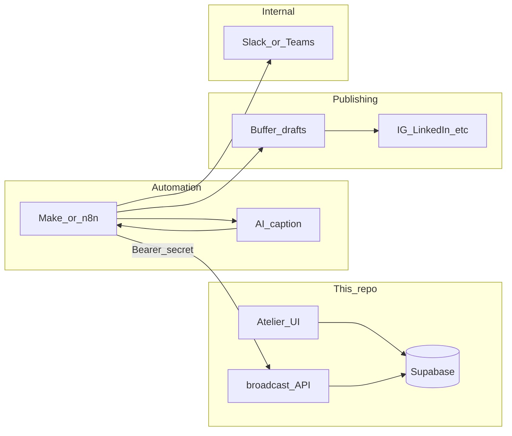

# Project synthesis (living document)

**Purpose:** One place to re-orient on stack, boundaries, and where truth lives. Update this file when you add major features, new env vars, production-impacting migrations, or new first-party API surfaces.

**Authoritative detail:** [CLAUDE.md](../CLAUDE.md) (agent + repo rules). **Route / tab map + Mermaid:** [SITE_MAP.md](../SITE_MAP.md) (repo root). If your checkout includes `AGENTS.md` (e.g. parent of `app/`), use it for lint / Playwright policy.

---

## Where we are (assessment)

| Stage | What “done” means | In this repo? | How to verify |
|--------|-------------------|---------------|----------------|
| **1 — Atelier** | Staff can flag works, add caption seed, admins see Broadcast tab | **Yes** — shipped | UI walkthrough; save/reload seed |
| **2 — Broadcast API** | Feed / queue / confirm / event + secret | **Yes** — shipped | `curl` or Make hitting prod; 401 without secret |
| **3 — Make / n8n** | Orchestration calls your API on the real host | **Configured outside git** | Scenario runs on schedule/trigger; logs show HTTP 200 to your routes |
| **4 — Buffer** | Drafts → human OK → publish to IG/LI/etc. | **No app code** (by design) | Buffer UI shows drafts from Make; a real post goes live |
| **5 — Slack / Teams** | Internal pings for VIP/errors/posted | **No app code** (by design) | Message appears in chosen channel when Make fires webhook |

**Important:** A **filled Broadcast panel** only proves **Supabase has rows** (`oeuvre_broadcasts`, `broadcast_events`) that `listBroadcastDashboard()` can read. Rows can come from **live Make**, **manual `curl`/Postman**, or **older confirm paths** — so treat the panel as **strong hint**, not a formal proof of the whole Make → Buffer → Slack chain.

**Bottom line today:** **1–2 are product-complete in code.** **3–5 are integration/ops**; you assess them in Make, Buffer, and Slack—not in `next build`.

---

## Plan for the rest

1. **Evidence pack (optional but clarifying)** — One nominal path written down: eligible work → `queue` → Buffer publish → `confirm` shows in **Publiés**; optional `event` in **Activité**. Screenshot or Make scenario export; lives in your wiki / Notion if you want, not necessarily in git.
2. **§2 — Repo quality (done)** — `ATELIER_E2E=1` Playwright (includes `tests/broadcast-tab.spec.ts`); **`npm run test:e2e:field`** runs hub / mobile-bar / field-launcher specs with env set via [`scripts/run-atelier-e2e.mjs`](../scripts/run-atelier-e2e.mjs); `npm run lint` + `npm run i18n:check` on merges (GitHub [`ci.yml`](../.github/workflows/ci.yml)); bilingual copy handoff [`archive/HANDOFF_SLICE4.md`](./archive/HANDOFF_SLICE4.md).
3. **Make resilience** — Error branches (API 5xx, 409 duplicate confirm), retries, alerting when feed is empty vs. misconfigured secret; document who owns the scenario.
4. **Buffer** — Approval habit, which profiles, second network (e.g. LinkedIn) if needed; all in Buffer + Make settings.
5. **Slack** — Which `event` types map to which channel; webhook rotation if exposed.
6. **App §3 (only if needed)** — Platform filter in Broadcast tab; real “unread” for VIP — both are optional product follow-ups.

Revisit this assessment when you add channels, change the Make scenario, or onboard a new operator.

---

## Next steps (prioritized)

Use this as the **forward queue**. Check items off when done; add dates in parentheses if useful.

### 1 — Operations (done 2026-09-01)

- [x] **Production DB:** Confirm `supabase/sql/broadcast_phase2.sql` is applied on **production** Supabase (same checks as dev). HTTP contract: [BROADCAST.md](./BROADCAST.md) and route sources under `app/api/inventory/broadcast/`.
- [x] **Vercel:** Set `INVENTORY_BROADCAST_SECRET` on Production (and Preview only if previews should hit the API). Same value will go into Make.
- [x] **Make / n8n:** Implement the live scenario — `GET feed` → `POST queue` per item → your AI + Buffer → `POST confirm` → optional `POST event`. Contract: [BROADCAST.md](./BROADCAST.md) + [`BROADCAST_OUTSIDE_CHAIN.md`](./BROADCAST_OUTSIDE_CHAIN.md).
- [x] **Smoke:** Exercise feed/queue/confirm/event against production host once secrets match (examples in Phase 2 doc + route handlers).

### 2 — Quality / regression (repo) (done)

- [x] **Playwright:** With a real logged-in session, `ATELIER_E2E=1 npm run test:e2e` (or targeted file) — includes `tests/broadcast-tab.spec.ts` and existing atelier specs. Narrow hub / Ring B: **`npm run test:e2e:field`** (same session requirement).
- [x] **Lint before merge:** `npm run lint` (workspace rule).

### 3 — Optional product follow-ups (only if operators ask)

- [ ] **Broadcast UI:** Platform filter or extra columns (LinkedIn vs Instagram) — data model already supports arbitrary platform slugs (`lib/broadcast-eligibility.ts`).
- [ ] **Broadcast counts:** `vipUnseen` in `app/atelier/broadcast/actions.ts` counts VIP rows in the fetched window, not a true “unread” cursor — rename or add persistence if you need inbox semantics.

### 4 — Explicitly *outside* this **Next.js** codebase

The **full line** still includes **Make → Buffer → social → Slack** above; those integrations are built in **middleware and third-party products**, not as `app/api/*` routes here unless scope changes. Do **not** duplicate into this repo: in-app AI caption generation, comment ingestion APIs, Slack outbound implemented in Next, first-comment automation, in-app VIP detection — keep that logic in **Make/n8n** and pass outcomes back via `confirm` / `event` (see [BROADCAST.md](./BROADCAST.md)).

---

## What this is

Internal **atelier / hub / galerie** app for an art inventory: works (`Oeuvres`), images (R2), contacts, pipelines, audit, portfolio PDF, and **inventory → social broadcast** hooks for middleware (Make/n8n).

---

## Social diffusion — full production line

This is the **intended operating chain** from inventory to internal awareness. Only the **Atelier + broadcast API** live in this repository; the rest is configured in Make (or n8n), Buffer, and Slack.

| Stage | System | Role |
|--------|--------|------|
| 1 | **Atelier (Next.js)** | Operators mark works `broadcast_ready`, optional `broadcast_caption_seed`; admins monitor **Diffusion → Broadcast** (`/atelier/broadcast`) — queue, posted history, activity. |
| 2 | **This app’s HTTP API** | `GET …/feed` → eligible payloads + `captionSeed`; `POST …/queue` locks a row; after real publish `POST …/confirm` stores `externalUrl` + `captionFinal`; optional `POST …/event` for VIP/normal events in the Atelier activity feed. Bearer `INVENTORY_BROADCAST_SECRET`. |
| 3 | **Make.com / n8n** | Orchestration hub: pull feed, call **AI** for caption copy from specs + seed, call **Buffer** to create/update **drafts**, call confirm/event back to this API, optionally branch on VIP vs noise. |
| 4 | **Buffer** | Human-in-the-loop: drafts land here for a short sanity check, then publish to **Instagram / LinkedIn** (or other connected profiles). |
| 5 | **Slack (or Teams)** | **Internal** notifications (e.g. VIP comment alerts, errors, “posted” pings) via Make modules + incoming webhooks — **not** implemented as routes in this repo; keep tokens and channel IDs in Make/env there. |

HTTP contract (endpoints + Bearer secret): [BROADCAST.md](./BROADCAST.md). **Build Make → Buffer → Slack:** [BROADCAST_OUTSIDE_CHAIN.md](./BROADCAST_OUTSIDE_CHAIN.md) *(Make.com only)*.

---

## Stack

| Layer | Choice |
|--------|--------|
| Framework | Next.js 15 App Router, React 19, TypeScript |
| Data | Supabase (Postgres + Auth + RLS) |
| Images | Cloudflare R2 via AWS S3 SDK; Sharp → AVIF thumbs |
| i18n | `lib/i18n/dictionary/` (`keys.ts`, `fr.ts`, `en.ts`) + barrel [`lib/i18n/dictionary.ts`](../lib/i18n/dictionary.ts) + `useI18n()` — **fr + en** for all user-visible copy |
| E2E | Playwright (`npm run test:e2e`); atelier flows gated on `ATELIER_E2E=1`; **`npm run test:e2e:field`** for hub field launcher + mobile action bar specs ([`scripts/run-atelier-e2e.mjs`](../scripts/run-atelier-e2e.mjs)) |
| PWA / iOS | [`app/manifest.ts`](../app/manifest.ts) (`/manifest.webmanifest`), `share_target` → `/atelier/share-receive`; static mirror [`public/manifest.webmanifest`](../public/manifest.webmanifest); **Apple touch** `public/pwa-icon-180.png` + [`app/layout.tsx`](../app/layout.tsx) |

---

## Run dev

From repo root: `pwsh scripts/dev.ps1` (frees port 3000, prints LAN URL for mobile). Or `npm run dev` on `0.0.0.0:3000`.

---

## Architecture rules (short)

- **Mutations:** Server Actions in `app/**/actions.ts` only — not ad-hoc API routes for app CRUD.
- **Exception:** `app/api/inventory/broadcast/*` — Bearer-authenticated JSON for **Make/n8n** only (see [BROADCAST.md](./BROADCAST.md)).
- **Auth:** Middleware protects `/atelier`, `/hub`, `/galerie`. **Admin** = `is_admin()` RPC (`Contact.is_admin` + `auth_user_id`). Do not use legacy `profiles.role`.
- **R2:** EU endpoint only — `https://<account_id>.eu.r2.cloudflarestorage.com` (see CLAUDE.md).

---

## Routes and modules

**Slice 3 + 3B (2026-05-23):** All 25 Atelier tabs are App Router segment routes; `/atelier` redirects to `/atelier/overview`; legacy `?tab=` redirects preserve other query params. **Handoff:** [archive/HANDOFF_SLICE3.md](./archive/HANDOFF_SLICE3.md).

**Canonical route / tab map:** [SITE_MAP.md](../SITE_MAP.md) (Mermaid, deep links, segment routes). **Pending work:** [TODO.md](./TODO.md). **Refactor plan:** [PEM_HYBRID_REFACTOR_PLAN_V5.md](./PEM_HYBRID_REFACTOR_PLAN_V5.md).

---

## Data conventions (do not regress)

- Work **status:** `Oeuvres.statusId` → `OeuvreStatus`. Legacy status columns are dead (see CLAUDE “cemetery”).
- **Themes:** junction `OeuvreTheme`; column `Oeuvres.theme` is read-only/dead.
- **Dates:** `Année` is DATE; use `yearOf()` from `lib/data.ts`.
- **Image URLs:** always `imageUrl()` / `thumbUrl()` from `lib/data.ts`.

---

## Admin protection phases (summary)

Hard delete and image hard-delete: **admin only** (RLS + `requireAdmin()`). Editor edits on existing works → **pending_changes** queue. **oeuvre_versions** snapshots on update. R2 deletes go through **soft-delete to `recycle/`**. DB backups: [BACKUP_RECOVERY.md](./BACKUP_RECOVERY.md).

---

## Env vars (high signal)

Document full list in `.env.local.example`. Critical groups:

- Supabase URL + anon + service role
- R2 credentials + EU endpoint
- `INVENTORY_BROADCAST_SECRET` — feed/queue/confirm/event routes + Make
- Optional dev: `DEV_AUTO_LOGIN_*` (never in production)

---

## Doc index

See [`docs/README.md`](./README.md) for the full list. High-signal:

| Doc | Contents |
|-----|----------|
| [CLAUDE.md](../CLAUDE.md) | Full conventions, mobile contract, PDF/R2 gotchas |
| [SITE_MAP.md](../SITE_MAP.md) | Routes, tabs, Mermaid topology |
| [TODO.md](./TODO.md) | Checklist + roadmap items |
| [BROADCAST.md](./BROADCAST.md) | Broadcast API + DB + UI pointers |
| [BROADCAST_OUTSIDE_CHAIN.md](./BROADCAST_OUTSIDE_CHAIN.md) | Make.com → Buffer → Slack |
| [BACKUP_RECOVERY.md](./BACKUP_RECOVERY.md) | Off-site DB backups + restore |

---

## When to update *this* synthesis

- [ ] **Next steps:** Add new forward items when scope changes. (§1 operations done 2026-09-01; §2 quality done.)
- [ ] New top-level route group or product surface (e.g. new `app/*` section).
- [ ] New required env var or renamed secret.
- [ ] New Supabase migration category (e.g. new RLS phase).
- [ ] New first-party HTTP API besides broadcast.
- [ ] Major orchestrator change (e.g. no longer `TeamPortalClient`-centric).

**Last reviewed (2026-05-23):** Docs archive sweep — slice handoffs in `docs/archive/`; slim `docs/README.md`; V5 plan + `TODO.md` canonical.
