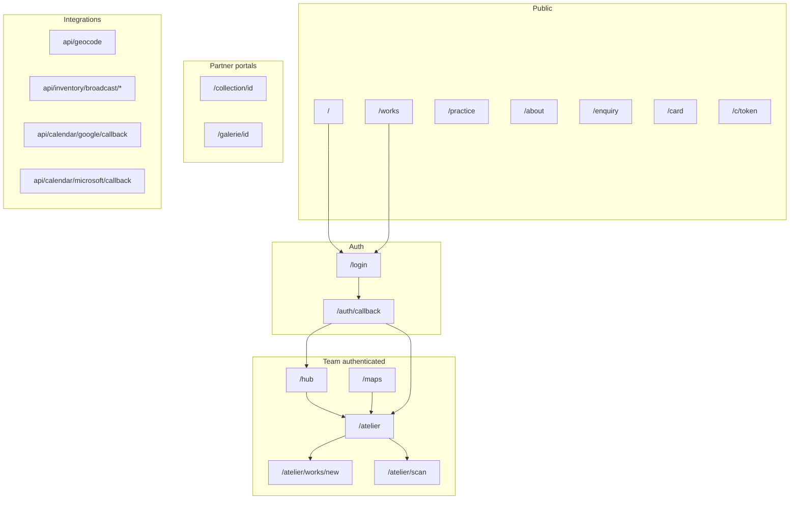
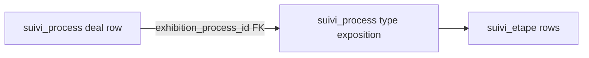

# PEM Hub — site map (authoritative routes & surfaces)

**Audience:** engineers and studio operators. **Companion:** QA checklist PDF (Atelier → System → download). **Diagrams:** Mermaid blocks below render on GitHub and most Markdown previews.

**Stack:** Next.js 15 App Router, Supabase auth, R2 (EU endpoint). **i18n:** user-facing UI is FR/EN via `lib/i18n/dictionary.ts`.

---

## 1. Route index (App Router)

### Public (no login)

| Path | Purpose |
|------|---------|
| `/` | Landing: navigation orbits, language toggle, optional portfolio PDF modal |
| `/works` | Public works / portfolio layout (collections from atelier config) |
| `/practice` | Artist practice / démarche |
| `/about` | Biography / CV |
| `/enquiry` | Visitor contact / enquiry (optional `?oeuvre_id=` / `?sale_order_id=` for after-sales routing) |
| `/verify/[certId]` | Certificate of authenticity verification (QR target; `SUPABASE_SERVICE_ROLE_KEY` required server-side) |
| `/card` | Printable business card sheet (`noindex`) |
| `/c/[token]` | Private selection link: validates `private_link` server-side, shows grouped works (`noindex`) |

### Auth

| Path | Purpose |
|------|---------|
| `/login` | Sign-in; `?next=` return path after success |
| `/auth/callback` | Supabase OAuth callback |

### Team (login required — see middleware)

| Path | Purpose |
|------|---------|
| `/hub` | Executive dashboard: stats, feeds (`system_log` audit rows + `studio_task` suggestions), tiles into Atelier & public site |
| `/atelier` | Main team portal (tabbed UI); see §3 |
| `/atelier/works/new` | Create work (`WorkForm`) |
| `/atelier/works/[id]/edit` | Redirects to `/atelier?work=<id>` (drawer) |
| `/atelier/scan` | Mobile scan / manual ID → open work drawer |
| `/maps` | Index of saved constellation maps → open in Atelier (`noindex`) |

### Partner portals (login + row-level checks in page)

| Path | Purpose |
|------|---------|
| `/collection/[collector_id]` | Collector: `Contact.auth_user_id` + `ContactID`; lists works with `AcheteurID` |
| `/galerie/[gallery_id]` | Gallery partner: `Role === 'gallery'`; active consignment works |

### Static / generated metadata

| Path | Purpose |
|------|---------|
| `/Atelier_Studio_Bible.pdf` | Redirects to short-lived signed URL for latest `document.kind = 'bible'` in vault |
| `/manifest.webmanifest` | PWA manifest (`start_url: /hub`) |

---

## 2. Middleware & layouts

**Session refresh:** [`middleware.ts`](../middleware.ts) runs Supabase cookie refresh on navigations (skips RSC/Flight).

**Document redirect to login** when unauthenticated and path matches:

- `/atelier`, `/hub`, `/galerie`, `/collection`, `/maps` (and subpaths)

**Layouts:** [`app/atelier/layout.tsx`](../app/atelier/layout.tsx), [`app/hub/layout.tsx`](../app/hub/layout.tsx), [`app/collection/layout.tsx`](../app/collection/layout.tsx), [`app/galerie/layout.tsx`](../app/galerie/layout.tsx) — team shell / portal chrome as applicable.

---

## 3. Atelier — tabs and deep links

Orchestrator: [`components/atelier/TeamPortalClient.tsx`](../components/atelier/TeamPortalClient.tsx).

**RSC data spine (`app/atelier/page.tsx`):** parallel reference queries for the first œuvres keyset chunk + lookups (techniques, themes, junction tables, etc.). `exhibition` rows are **not** loaded here — [`ExhibitionsTab.tsx`](../components/atelier/ExhibitionsTab.tsx) fetches its own `suivi_process` list. `contact_addresses` loads **after first paint** via server action [`fetchAtelierContactAddresses`](../app/atelier/atelier-data-actions.ts) for curation/compare. Unread `suivi_reminder` rows are passed as `initialReminders` from [`listUnreadSuiviReminders`](../app/atelier/reminders-actions.ts) for overview + pipeline initial paint; mutations revalidate via `revalidateRemindersTag()` + `router.refresh()`.

### Atelier bootstrap server modules (not HTTP routes)

| Module | Role |
|--------|------|
| [`app/atelier/reminders-actions.ts`](../app/atelier/reminders-actions.ts) | `getUnreadReminderCountCached`, `listUnreadSuiviReminders`, `markSuiviReminderRead`, `insertSuiviReminder`, `revalidateRemindersTag` — RSC + client-refresh path for `suivi_reminder` |
| [`app/atelier/atelier-data-actions.ts`](../app/atelier/atelier-data-actions.ts) | `fetchAtelierContactAddresses` — post–first-paint flat list for curation dock / compare modal |
| [`app/atelier/system/ledger-attachment-actions.ts`](../app/atelier/system/ledger-attachment-actions.ts) | `uploadLedgerAttachment` — team-gated R2 upload for System Ledger screenshots (`ledger/*` keys; metadata in `system_log.attachments`) |
| [`app/atelier/system-reference-actions.ts`](../app/atelier/system-reference-actions.ts) | `getSystemLedgerReferenceMarkdown` — reads `docs/SYSTEM_LEDGER.md` for copy/download on **System** tab |
| [`app/atelier/system/actions.ts`](../app/atelier/system/actions.ts) | `deleteStudioTask` — admin-only delete on `studio_task` (Hub “pulse” task list) |

These are **`'use server'`** modules (callable from Server Components and from the client after hydration), distinct from `app/api/**` route handlers. Domain **writes** for works, contacts, etc. remain in `app/**/actions.ts` per CLAUDE.md.

### Query string contract

| Param | Behavior |
|-------|----------|
| `?tab=<Tab>` | Opens tab (`Tab` union in `TeamPortalClient`; persisted in `localStorage` as `pem_team_tab`) |
| `?work=<OeuvreID>` | Opens **WorkDrawer** for work after load; stripped from URL after open |
| `?map=<uuid>` | Constellation tab loads cloud map via `loadConstellationMap`; param stripped after load |
| `?exhibition=<processId>` | Exhibitions tab selects that `suivi_process` id (see [`ExhibitionsTab.tsx`](../components/atelier/ExhibitionsTab.tsx)) |
| `?calendar=google_ok` / `microsoft_ok` / `*_err` | OAuth return banner in Exhibitions; params cleaned from URL |

### Tab list (desktop group order)

**Terrain / Field (narrow sidebar first):** `inventory`, `production`, `stock-take`, `overview` then operations, management, vision, commercial, diffusion, config.

**Full tab ids:** `overview`, `inventory`, `constellation`, `production`, `logistics`, `sales`, `exhibitions`, `vault`, `contacts`, `map`, `pipeline`, `fiscal`, `concepts`, `themes`, `stock`, `stock-take`, `system`, `portfolio`, `audit` (admin), `broadcast` (admin).

### Major client surfaces

- **WorkDrawer** — canonical edit: shell in [`WorkDrawer.tsx`](../components/atelier/WorkDrawer.tsx); inner panels under [`components/atelier/work-drawer/`](../components/atelier/work-drawer/) (`DrawerContent`, pipeline, finance, notes/version, groups, images, `drawer-widgets`, `drawer-content-utils`).
- **WorkForm** — create-only at `/atelier/works/new`.
- **SystemTab** — [`SystemTab.tsx`](../components/atelier/SystemTab.tsx): manual **`system_log`** ledger (`event_type` null), optional **`attachments`** (R2 `ledger/*` via [`ledger-attachment-actions.ts`](../app/atelier/system/ledger-attachment-actions.ts)); site checklist PDF, Studio Bible vault, reference MD (`system-reference-actions`).
- **BroadcastTab** — admin-only diffusion queue (server-gated).
- **AuditTab** — admin ledger + pending review + version tooling entrypoints.
- **VaultTab** — documents; bible regeneration from **System** tab (`vaultStudioBible`).

---

## 4. HTTP route handlers (`app/api/**`, `app/**/route.ts`)

| Route | Auth | Purpose |
|-------|------|---------|
| `POST` | Bearer `CRON_SECRET` | [`app/api/cron/return-window/route.ts`](../app/api/cron/return-window/route.ts) — applies expired sale return windows (`sale_order` → archive sold works) |
| `GET/POST` … | varies | [`app/api/geocode/route.ts`](../app/api/geocode/route.ts) — geocoding helper |
| `GET` … | Bearer `INVENTORY_BROADCAST_SECRET` | [`feed`](../app/api/inventory/broadcast/feed/route.ts), [`queue`](../app/api/inventory/broadcast/queue/route.ts), [`confirm`](../app/api/inventory/broadcast/confirm/route.ts), [`event`](../app/api/inventory/broadcast/event/route.ts) — Make/n8n broadcast chain; shared in-process rate limit [`lib/inventory-broadcast-rate-limit.ts`](../lib/inventory-broadcast-rate-limit.ts) → HTTP 429 |
| `GET` | OAuth state | [`app/api/calendar/google/callback/route.ts`](../app/api/calendar/google/callback/route.ts), [`microsoft/callback`](../app/api/calendar/microsoft/callback/route.ts) |

Domain mutations remain in **`app/**/actions.ts`** server actions; these routes are integration/OAuth/read surfaces (see CLAUDE.md exception list).

---

## 5. Exhibitions ↔ pipeline (data model)

- **Table:** `suivi_process` — one row per “process” (types include `vente`, `exposition`, `residence`, `expedition`, `consignment`, …).
- **Exhibition project:** rows with `type = 'exposition'` and schedule (`date_debut` / `date_fin`); listed in **Exhibitions** tab. Granular work uses **`suivi_etape`** rows keyed by `process_id`.
- **Link from commercial pipeline:** column **`exhibition_process_id`** on a pipeline `suivi_process` row points to the **`exposition`** row. Created from **Pipeline** process modal: insert `exposition` process, then `UPDATE` current process `exhibition_process_id = <new id>`. Drawer button **Open exhibition project** → `/atelier?tab=exhibitions&exhibition=<id>`.
- **Product meaning:** the exposition process is a **first-class sub-process** (own steps, calendar, floor plan), not a single checklist étape on the parent deal row. The **originating pipeline process** remains the commercial track that **references** the exhibition umbrella.
- **Delete exhibition:** [`ExhibitionsTab`](../components/atelier/ExhibitionsTab.tsx) clears `exhibition_process_id` on any referencing processes, then deletes the `exposition` row.

---

## 6. Mermaid — product topology

---

## 7. Mermaid — exhibition vs pipeline row

---

## 8. Admin vs editor (short)

- **Admin:** `is_admin()` RPC — hard delete, image delete, Audit review, Broadcast, some destructive studio tasks.
- **Editor:** `is_team()` without admin — soft delete works; existing-work edits may enqueue `pending_changes`.

---

## 9. R2 / assets

- **Public images:** `NEXT_PUBLIC_R2_PUBLIC_URL` + keys from `lib/data.ts` helpers.
- **Private vault / bible:** EU S3 endpoint `https://<account_id>.eu.r2.cloudflarestorage.com` only.
- **System ledger screenshots:** object keys prefix **`ledger/`** on the main paintings bucket; **`system_log.attachments`** stores `{ key }[]`. Lifecycle (Cloudflare console): delete **`ledger/`** objects after **30 days** — see `CLAUDE.md` Phase D; UI tolerates expired keys (`onError` on thumbnails).

---

## 10. Changelog discipline

When adding a **page**, **tab id**, **API route**, or **Atelier bootstrap `app/atelier/*-actions.ts` module** surfaced to operators, update this file, the QA checklist PDF source (`lib/site-map-checklist-pdf.ts`), and regenerate the **Studio Bible** from Atelier → System if narrative sections should stay aligned.
